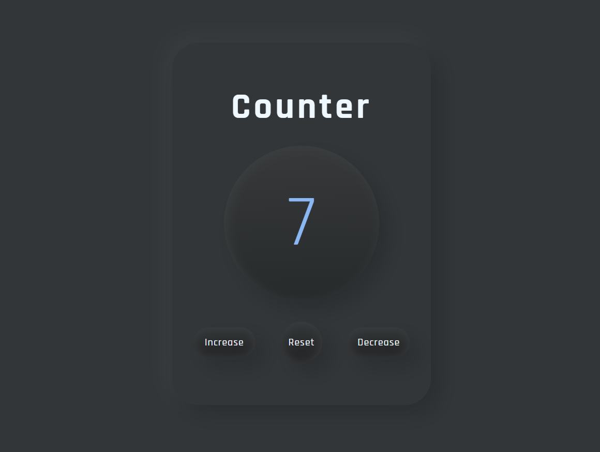

# Counter APP

Counter app is a small Vanilla JS project to sharpen my JavaScript skills.

## Project Goal

- Initialize counter variable.
- Select buttons to interact.
- Select counter display element
- Add event listeners to each button
- Increase, decrease & reset counter when clicked
- Change colors if count is smaller or larger than 0

## Live

You can check the project here. [▶ Counter App]().
